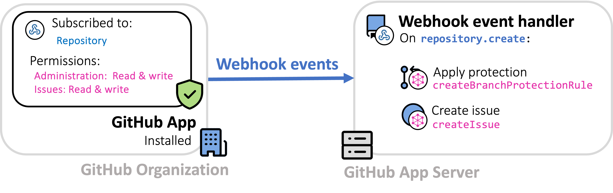
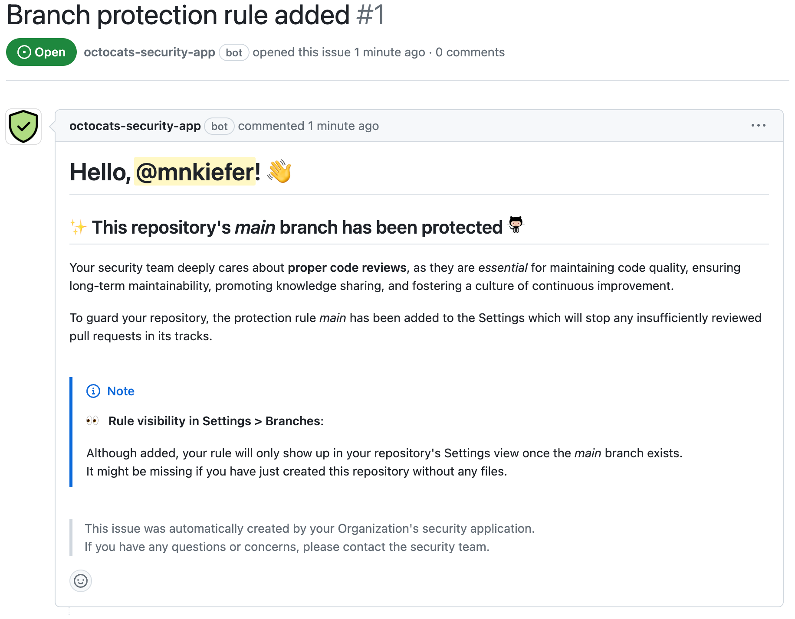

# Welcome to `octocats-security-app`

`octocats-security-app` is a [GitHub App](https://docs.github.com/en/apps/overview#about-github-apps) that ensures the use of *proper code reviews* in all repositories within a given [GitHub organization](https://docs.github.com/en/organizations/collaborating-with-groups-in-organizations/about-organizations).

> [!NOTE]
> This application has been designed to serve as a *prototype* (see *Figure 1* below) to solve the following (fabricated) **customer scenario**:
>> "Our security team is asking for help ensuring proper reviews are being done to code being added into our repositories. We have hundreds of repositories in our organization. What is the best way we can achieve at scale? We are new to some of the out-of-the-box settings and the GitHub API. Can you please help us create a solution that will accomplish this for our security team?"

## Design

To meet the customer's requirements, the organization can install a [GitHub App](https://docs.github.com/en/apps/overview#about-github-apps) (such as `octocats-security-app`), which uses [GitHub Webhooks](https://docs.github.com/en/webhooks/about-webhooks#events) to react on repository creation and performs subsequent tasks (Apply protection, Create issue) by making requests to the [GitHub GraphQL API](https://docs.github.com/en/graphql/overview/about-the-graphql-api):

<br><br>
<figure>
  <picture>
    <source media="(prefers-color-scheme: dark)" srcset="./_assets/solution-design_dark.png">
    
  </picture>
  <figcaption>
    <b>Figure 1</b>: <i>Schematic diagram of the solution design.</i>
  </figcaption>
</figure>
<br><br>

The next section provides more details on the setup of this prototype and describes how to test-drive it locally.

## Setup

To test this application locally, start by cloning this repository and install the dependencies:
```sh
git clone https://github.com/mnkiefer/octocats-security-app.git
cd octocats-security-app
npm ci
```

Before we can run the application, we need to choose a GitHub organization that the application will be [*registered*](#register-the-github-app) and [*installed*](#install-the-github-app) on so that we can receive its events.

### Register the GitHub App

> [!IMPORTANT]
> You will need to store some of the information generated below in your app's root directory in a _.env_ file which should contain the following:
> ```
> APP_ID="YOUR_APP_ID"
> WEBHOOK_SECRET="YOUR_WEBHOOK_SECRET"
> PRIVATE_KEY_PATH="YOUR_PRIVATE_KEY_PATH"
> ```
> For your convenience, they are marked in the following text with a " :pencil2: " symbol.

1. Navigate to your organization's *Settings* page.
2. From the left-hand-side menu, choose: *Developer Settings* > *GitHub Apps*:<br>
   Under the **GitHub Apps** section, press the button "New GitHub App".

3. Fill out the GitHub App form as follows:
    - *GitHub App name*: `octocats-security-app`
    - *Homepage URL*: `https://github.com/mnkiefer/octocats-security-app`
    - **Webhook**:
      - [X] Active
      - To get the *Webhook URL*:
        - In a new browser window, navigate to [smee.io](https://smee.io/)
        - Click "Start a new channel"
        - Copy the full URL under "Webhook Proxy URL"
        - Replace the `YOUR_WEBHOOK_URL` string in your checked out application's _package.json_ file *scripts*.
      - *Webhook secret*: Enter a random string → :pencil2: `PRIVATE_KEY_PATH`
    - **Permissions > Repository permissions**:
      - `Administration: Read and write`
      - `Issues: Read and write`
    - **Subscribe to events**:
      - [X] Repository
    - **Where can this GitHub App be installed?**:
      - [X] Any account

    Click on the "Create GitHub App" button to finish registration. In the **About** section, you can find your registered app's *App ID*. → :pencil2: `APP_ID`

    Scroll down the page to the **Private keys** section and press the "Generate a private key" button. This will trigger a file download. Securely store this file and your local machine and keep track of its location path. → :pencil2: `PRIVATE_KEY_PATH`

### Install the GitHub App:

  - On the left-hand side menu, go to *Public Page*
  - Click on the *Install* button
    - Select your organization
    - [X] *All repositories*
  - Click the *Install* button

### Run the application

Now that the application has been registered and installed to the organization, we are ready for testing. To start the app's server, return to your local clone of this application and run:
```
npm ci
npm run dev
```
In your console output, you can verify that your setup is complete by checking that the server is listening for events and that your smee channel is forwarding to your local application.

You can now navigate to your organization page on GitHub and create a new repository, let's call it `my-repo-0`. Once your repository has been created, navigate to the new repositories **Issues** page and verify that an issues has been created, notifying you that the *main* branch protection is now active for this repository.

<br><br>
<figure>
  <picture>
    <source media="(prefers-color-scheme: dark)" srcset="./_assets/issue_dark.png">
    
  </picture>
  <figcaption>
    <b>Figure 2</b>: <i>The issue created by the GitHub App to notify the repository's creator (in this case @mnkiefer) about the applied main branch protection by the security team.</i>
  </figcaption>
</figure>
<br><br>

You can also check your server output logs to see the key events/tasks that have taken place:
```
[my-repo-0] - Received *repository.create* event
[my-repo-0] - Added *main* branch protection rule
[my-repo-0] - Opened issue #1
```

## References

- GitHub App:
  - [Deciding when to build a GitHub App](https://docs.github.com/en/apps/creating-github-apps/about-creating-github-apps/deciding-when-to-build-a-github-app)
  - [Best practices for creating a GitHub App](https://docs.github.com/en/apps/creating-github-apps/about-creating-github-apps/best-practices-for-creating-a-github-app)
- GitHub Webhooks:
  - [GitHub Webhooks](https://docs.github.com/en/webhooks/about-webhooks#events)
  - [Building a GitHub App that responds to webhook events](https://docs.github.com/en/apps/creating-github-apps/writing-code-for-a-github-app/building-a-github-app-that-responds-to-webhook-events)
- GitHub API:
  - [Comparing GitHub's REST API and GraphQL API](https://docs.github.com/en/rest/about-the-rest-api/comparing-githubs-rest-api-and-graphql-api?apiVersion=2022-11-28) 
  - [GraphQL API Queries](https://github.com/octokit/octokit.js?tab=readme-ov-file#graphql-api-queries)
- Text:
  - [Basic writing and formatting syntax](https://docs.github.com/en/get-started/writing-on-github/getting-started-with-writing-and-formatting-on-github/basic-writing-and-formatting-syntax#mentioning-users-and-teams)
- Images:
  - [Ocitcons icons](https://primer.style/foundations/icons)
  - [Octodex images](https://octodex.github.com/)
